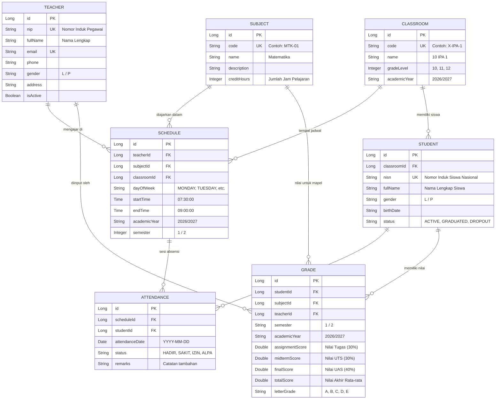
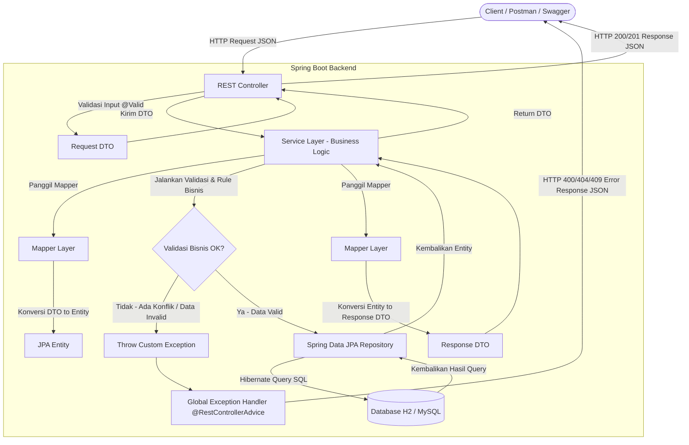
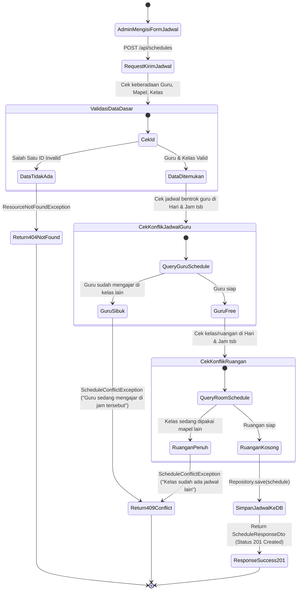
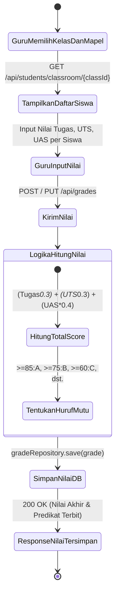

# 📚 DOKUMENTASI DESAIN SISTEM INFORMASI SEKOLAH (BACKEND REST API)

Dokumentasi ini berisi cetak biru (*blueprint*) arsitektur backend, **Entity Relationship Diagram (ERD)**, **Flowchart**, **Activity Diagram**, dan **Daftar Endpoint REST API**.

---

## 1. 🗄️ Entity Relationship Diagram (ERD)

Diagram relasi antar tabel dalam database:

---

## 2. 🏗️ Flowchart Arsitektur Backend (Layered Architecture)

Alur pergerakan data dari Request Client hingga masuk ke Database dan kembali sebagai Response:

---

## 3. 🔄 Activity Diagrams

### A. Activity Diagram: Tambah Jadwal Pelajaran (Dengan Validasi Konflik)
Fitur unggulan: Otomatis mendeteksi jika guru atau kelas sudah memiliki jadwal mengajar di hari dan rentang jam yang sama.

---

### B. Activity Diagram: Input & Rekap Nilai Siswa (Oleh Guru)

---

## 4. 📡 Rencana Spesifikasi Endpoint REST API

| Modul | Method | Endpoint | Deskripsi | Status Code |
| :--- | :--- | :--- | :--- | :--- |
| **Subjects** | `POST` | `/api/subjects` | Menambah mata pelajaran baru | `201 Created` |
| | `GET` | `/api/subjects` | Mengambil seluruh mata pelajaran | `200 OK` |
| | `GET` | `/api/subjects/{id}` | Mengambil detail mata pelajaran | `200 OK` |
| | `PUT` | `/api/subjects/{id}` | Mengubah data mata pelajaran | `200 OK` |
| | `DELETE` | `/api/subjects/{id}` | Menghapus mata pelajaran | `204 No Content` |
| **Teachers** | `POST` | `/api/teachers` | Menambah data guru baru | `201 Created` |
| | `GET` | `/api/teachers` | Mengambil semua guru (Support filter/search) | `200 OK` |
| | `GET` | `/api/teachers/{id}` | Mengambil detail profil guru | `200 OK` |
| | `PUT` | `/api/teachers/{id}` | Memperbarui data guru | `200 OK` |
| | `DELETE` | `/api/teachers/{id}` | Menghapus guru | `204 No Content` |
| **Classrooms** | `POST` | `/api/classrooms` | Membuat kelas baru | `201 Created` |
| | `GET` | `/api/classrooms` | Mengambil daftar semua kelas | `200 OK` |
| | `GET` | `/api/classrooms/{id}` | Detail kelas beserta daftar siswanya | `200 OK` |
| **Schedules** | `POST` | `/api/schedules` | Membuat jadwal baru (+ Validasi tabrakan) | `201 Created` / `409 Conflict` |
| | `GET` | `/api/schedules` | Mengambil semua jadwal | `200 OK` |
| | `GET` | `/api/schedules/teacher/{teacherId}` | Mengambil jadwal mengajar guru tertentu | `200 OK` |
| | `GET` | `/api/schedules/classroom/{classroomId}` | Mengambil jadwal kelas tertentu | `200 OK` |
| **Students** | `POST` | `/api/students` | Mendaftarkan siswa ke kelas | `201 Created` |
| | `GET` | `/api/students` | Mengambil semua siswa (Support search nama/nisn) | `200 OK` |
| | `GET` | `/api/students/{id}` | Detail profil lengkap siswa | `200 OK` |
| | `GET` | `/api/students/classroom/{classroomId}` | Daftar siswa dalam kelas tertentu | `200 OK` |
| | `PUT` | `/api/students/{id}` | Memperbarui data siswa | `200 OK` |
| | `DELETE` | `/api/students/{id}` | Menghapus data siswa (Soft delete) | `204 No Content` |
| **Assignments** | `POST` | `/api/assignments` | Guru membuat tugas baru | `201 Created` |
| | `POST` | `/api/assignments/{id}/scores` | Input nilai tugas siswa | `200 OK` |
| **Grades** | `POST` | `/api/grades` | Input nilai UTS & UAS per mapel | `201 Created` |
| | `GET` | `/api/grades/student/{studentId}` | Mengambil semua nilai mentah siswa | `200 OK` |
| **Attendance** | `POST` | `/api/attendances/batch` | Input absensi massal satu kelas | `201 Created` |
| | `GET` | `/api/attendances/schedule/{scheduleId}` | Rekap absensi sesi jadwal | `200 OK` |
| **Reports & Transkrip** 🌟 | `GET` | `/api/reports/midterm` | **Rapor UTS** (Nilai Tugas + UTS + Absensi) | `200 OK` |
| | `GET` | `/api/reports/final` | **Rapor Akhir Semester** (Tugas + UTS + UAS + Predikat) | `200 OK` |
| | `GET` | `/api/reports/transcript/{studentId}` | **Transkrip Nilai Kumulatif** (Kelas 1 s/d 3 / Seluruh Semester) | `200 OK` |

---

Dokumentasi ini menjadi panduan baku selama proses pengerjaan kode backend.
