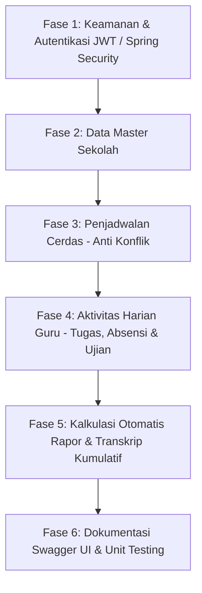

# 📋 RENCANA TASK & ROADMAP EKSEKUSI SISTEM INFORMASI SEKOLAH

Status: **SELESAI 100% (COMPLETED)** ✅

---

## 🗺️ Gambaran Alur Eksekusi (Phase Overview)

---

## 📌 Rincian Status per Fase

### 🛡️ FASE 1: Keamanan & Autentikasi (Spring Security + JWT)
- [x] **Task 1.1**: Pasang dependensi `spring-boot-starter-security`, `jjwt` (Java JWT), dan `spring-boot-starter-validation` di `pom.xml`.
- [x] **Task 1.2**: Buat Entitas `User` dan Enum `Role` (`ROLE_ADMIN`, `ROLE_TEACHER`).
- [x] **Task 1.3**: Buat `UserRepository` dan `CustomUserDetailsService`.
- [x] **Task 1.4**: Buat komponen keamanan JWT:
  - `JwtUtils` (Generate token, parse claims, validasi token).
  - `JwtAuthenticationFilter` (Filter interceptor token pada setiap request).
  - `SecurityConfig` (`SecurityFilterChain`, `BCryptPasswordEncoder`, CORS, Session Stateless).
- [x] **Task 1.5**: Buat DTO Autentikasi (`LoginRequestDto`, `RegisterRequestDto`, `AuthResponseDto`).
- [x] **Task 1.6**: Buat `AuthService` dan `AuthController` (`POST /api/auth/register`, `POST /api/auth/login`).
- [x] **Task 1.7**: Setup **Global Exception Handler** (`@RestControllerAdvice`) & format respon standar `ApiResponse<T>`.

---

### 🏛️ FASE 2: Data Master Sekolah (Admin Role)
- [x] **Task 2.1**: **Modul Mata Pelajaran (`Subject`)**
  - Entity, DTO, Mapper, Repository, Service, Controller.
  - CRUD endpoint: `POST`, `GET`, `PUT`, `DELETE /api/subjects`.
- [x] **Task 2.2**: **Modul Kelas (`Classroom`)**
  - Entity, DTO, Mapper, Repository, Service, Controller.
  - CRUD endpoint: `POST`, `GET`, `PUT`, `DELETE /api/classrooms`.
- [x] **Task 2.3**: **Modul Guru (`Teacher`)**
  - Entity relasi dengan `User` dan `Subject`.
  - CRUD endpoint: `POST`, `GET`, `PUT`, `DELETE /api/teachers`.
- [x] **Task 2.4**: **Modul Siswa (`Student`)**
  - Entity dengan relasi `@ManyToOne` ke `Classroom`.
  - CRUD endpoint + Filter siswa per kelas (`GET /api/students/classroom/{classId}`).

---

### ⏰ FASE 3: Penjadwalan Cerdas / Smart Scheduling (Algoritma Anti-Konflik)
- [x] **Task 3.1**: Buat Entity `Schedule` (Guru + Mapel + Kelas + Hari + Jam Mulai & Selesai).
- [x] **Task 3.2**: Buat **Algoritma Overlapping Interval Detection** di `ScheduleServiceImpl`:
  - Validasi 1: Mencegah Guru mengajar di 2 kelas berbeda di jam yang sama.
  - Validasi 2: Mencegah Kelas dipakai oleh 2 mapel berbeda di jam yang sama.
- [x] **Task 3.3**: Buat Custom Exception `ScheduleConflictException` (mengembalikan HTTP 409 Conflict).
- [x] **Task 3.4**: Buat endpoint filter jadwal mengajar pribadi untuk Guru yang sedang login (`GET /api/schedules/my-schedule`).

---

### 📝 FASE 4: Aktivitas Harian Guru (Tugas, Absensi, & Nilai)
- [x] **Task 4.1**: **Modul Tugas Harian (`Assignment` & `AssignmentScore`)**
  - Guru membuat tugas per mapel & kelas (`POST /api/assignments`).
  - Guru menginput nilai tugas siswa (`POST /api/assignments/{id}/scores`).
- [x] **Task 4.2**: **Modul Absensi Siswa (`Attendance`)**
  - Input absensi massal satu kelas dengan `@Transactional` batch (`POST /api/attendances/batch`).
  - Rekap persentase kehadiran siswa (`/api/attendances/student/{id}/summary`).
- [x] **Task 4.3**: **Modul Nilai Ujian (`Grade`)**
  - Input nilai murni UTS dan UAS per siswa (`POST /api/grades`).

---

### 🏆 FASE 5: Mesin Kalkulasi Rapor & Transkrip Kumulatif
- [x] **Task 5.1**: **Engine Rapor UTS (`MidtermReportService`)**
  - Otomatis menghitung rata-rata tugas harian + nilai UTS + rekap absensi.
  - Endpoint: `GET /api/reports/midterm`.
- [x] **Task 5.2**: **Engine Rapor Akhir Semester (`FinalReportService`)**
  - Perhitungan bobot: $(Tugas \times 30\%) + (UTS \times 30\%) + (UAS \times 40\%)$.
  - Auto-generate Predikat Huruf Mutu (*A, B, C, D*) dan verifikasi KKM.
  - Endpoint: `GET /api/reports/final`.
- [x] **Task 5.3**: **Engine Transkrip Kumulatif SMP (`TranscriptService`)**
  - Agregasi nilai multi-semester (Kelas 7, 8, 9 / Semester 1 s/d 6).
  - Kalkulasi IPK Rata-Rata Kumulatif Ijazah & Status Kelulusan.
  - Endpoint: `GET /api/reports/transcript/{studentId}`.

---

### 🧪 FASE 6: Dokumentasi Swagger UI & Automated Testing
- [x] **Task 6.1**: Pasang **Springdoc OpenAPI / Swagger UI** (`/swagger-ui/index.html`).
- [x] **Task 6.2**: Buat **Unit Testing (JUnit 5 & Mockito)**:
  - Test skenario bentrok jadwal pada `ScheduleServiceTest`.
- [x] **Task 6.3**: Buat file dokumentasi panduan eksekusi `README.md` untuk rekruter.
- [x] **Task 6.4**: Buat `DataInitializer` untuk auto-seed akun demo & sampel data.
